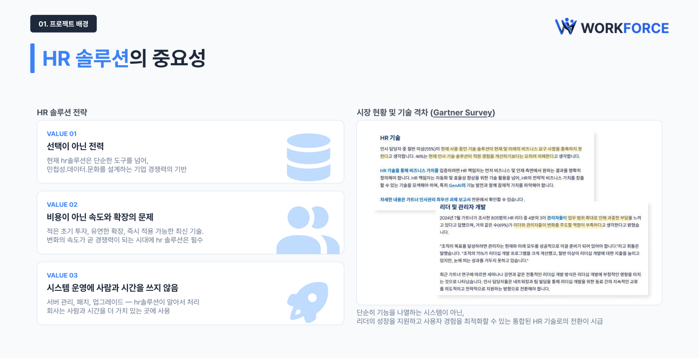
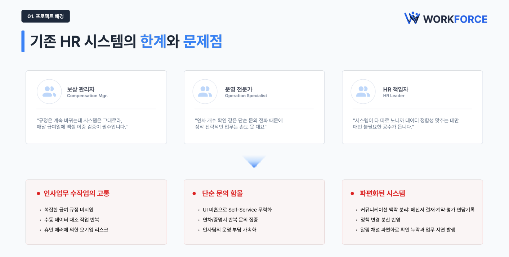
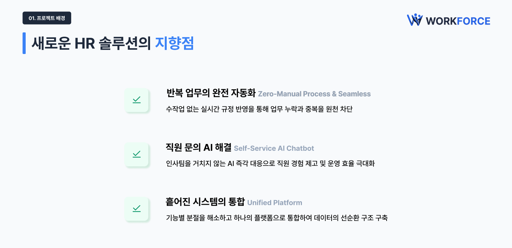
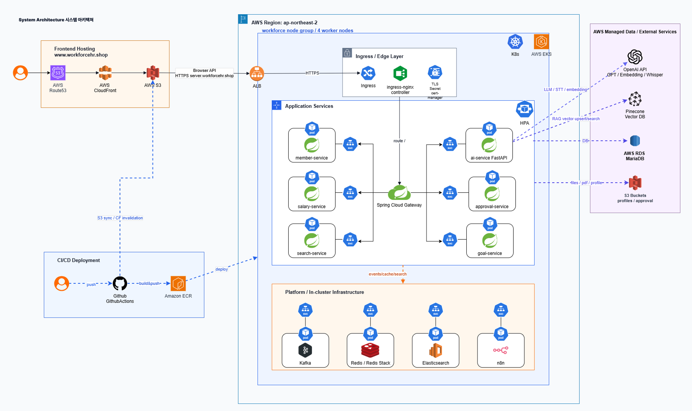
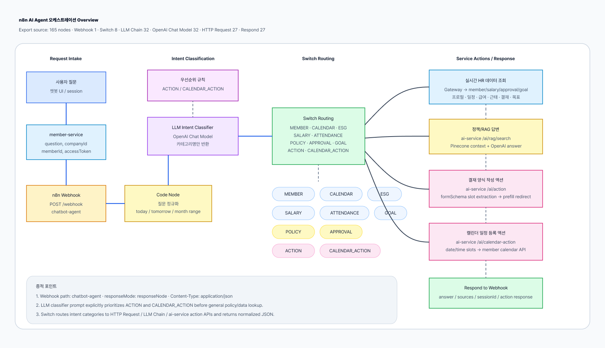

> **WORKFORCE**는 파편화된 HR 시스템과 반복 수작업으로 인한 인사 운영의 비효율을 해소하는 AI 기반 통합 HRMS입니다. 
> 근태·급여·결재·평가·ESG·전자계약을 하나의 데이터 흐름으로 연결하고, 회사별 인사 정책을 AI 챗봇과 자동화 모듈에 실시간 반영하여 인사팀의 수작업 없이도 누구나 정확한 정보를 즉시 얻을 수 있는 환경을 만듭니다.

---

## 팀원 소개

|  |  |  |  |
|----------------|-----------------|-----------------|-----------------|
| [김정훈](https://github.com/jeonghuny) | [박세민](https://github.com/semin980520) | [이다은](https://github.com/leeda973) | [이지연](https://github.com/jiyean99) |

---

## 목차

1. [서비스 개요](#서비스-개요)
2. [주요 기능](#주요-기능)
3. [기술 스택](#기술-스택)
4. [시스템 아키텍처 & n8n AI Agent 오케스트레이션](#시스템-아키텍처--n8n-ai-agent-오케스트레이션)
5. [기술 문서](#기술-문서)
6. [트러블슈팅](#트러블슈팅)
7. [시연 영상](#시연-영상)
8. [부록](#부록)
---

## 서비스 개요

> **반복 수작업, 단순 문의, 파편화된 HR 시스템을 AI와 이벤트 기반 자동화로 연결하는 Zero-Manual HRMS**

WORKFORCE는 기존 HR 시스템이 현장의 업무 흐름을 충분히 따라가지 못한다는 문제의식에서 출발했습니다.  
아래 세 장의 흐름처럼, **HR 솔루션의 필요성 → 기존 시스템의 한계 → WORKFORCE의 해결 방향** 순서로 문제와 솔루션을 정의했습니다.

  

> HR 솔루션은 더 이상 선택적인 관리 도구가 아니라, 인사 운영의 속도와 정확도를 결정하는 핵심 전략입니다.  
> 복잡해지는 규정과 빠르게 바뀌는 업무 환경 속에서, HR 시스템은 단순 기록을 넘어 **사람의 시간을 가장 가치 있는 업무에 쓰게 만드는 기반**이 되어야 합니다.

  

> 하지만 현장의 HR 담당자는 여전히 수작업, 반복 문의, 분리된 시스템 사이에서 시간을 잃고 있습니다.  
> 급여 규정은 계속 바뀌는데 검증은 엑셀에 의존하고, 연차나 증명서 같은 단순 문의는 인사팀으로 몰리며, 결재·계약·평가·면담 기록은 각기 다른 도구에 흩어져 있습니다.

  

> WORKFORCE는 이 문제를 기능 추가가 아니라 **운영 흐름의 연결**로 해결합니다.  
> 반복 업무는 자동화하고, 직원 문의는 AI가 즉시 응답하며, 흩어진 HR 데이터는 하나의 플랫폼에서 이어지도록 설계했습니다.

### WORKFORCE가 해결하는 방식

| 문제 정의 | 해결 방향 | 핵심 기능 |
|-----------|-----------|-----------|
| 인사업무 수작업의 고통 | 급여/근태/휴가 규정을 회사 정책으로 관리하고 정기 작업을 자동 실행 | 회사별 정책 설정, Quartz, Spring Batch |
| 단순 문의에 묶이는 인사팀 | 사용법, 정책, 실시간 HR 데이터를 AI 챗봇이 대화형으로 안내 | AI 챗봇, RAG, 실시간 API 조회 |
| 파편화된 업무 시스템 | 결재 승인 이후 근태, 급여, 캘린더, 알림까지 이벤트로 연결 | Kafka 이벤트, Redis Pub/Sub, SSE |
| 정책 변경의 분산 반영 | 정책과 결재 양식 변경을 AI 검색 인덱스와 후속 업무에 동기화 | HR 정책 문서, 동적 결재 양식, 벡터 DB 갱신 |
| 조직 참여 데이터의 분리 | ESG 활동과 포인트, 캠페인을 HR 데이터 흐름 안에서 관리 | ESG 활동 관리, ESG 샵 |

<strong>시장 분석 근거</strong>

HR SaaS와 AI 기반 업무 자동화 수요는 증가하고 있지만, HR 운영 현장에서는 기존 기술 스택이 현재와 미래의 업무 요구를 충분히 충족하지 못한다는 문제가 남아 있습니다.  
특히 인사 담당자는 복잡한 급여 규정 미지원, 수동 데이터 대조, 휴먼 에러 리스크, 반복 문의, 정책 변경의 분산 반영, 알림 채널 파편화로 인한 누락과 지연을 동시에 겪습니다.

WORKFORCE는 이 지점을 **수작업을 줄이는 자동화, 문의를 흡수하는 AI, 흩어진 업무를 잇는 이벤트 기반 HRMS**라는 방향으로 풀었습니다.

[MTN HR 시장 기사](https://news.mtn.co.kr/news-detail/2023022310563781713) · [KDI 디지털 성숙도 조사](https://eiec.kdi.re.kr/policy/domesticView.do?ac=0000156198) · [다우오피스HR 인사담당자 현황](https://hr.daouoffice.com/blog/sme-hr-manager-recruitment-burnout) · [디지털데일리 HR테크 기사](https://www.ddaily.co.kr/page/view/2024050511345817576)

 

<a href="#목차">맨 위로</a>

---

## 주요 기능

### 1. AI 챗봇 기반 온보딩

- 신입사원과 일반 사용자가 인사 시스템 사용법을 자연어로 질문할 수 있습니다.
- 회사 정책, 결재 양식, 휴가/급여/근태 규정을 RAG 기반으로 조회합니다.
- “내 잔여 연차 얼마야?”처럼 실시간 데이터가 필요한 질문은 백엔드 API를 호출해 답변합니다.
- “내일 연차 신청해줘”, “금요일 2시에 회의 일정 잡아줘”처럼 대화에서 필요한 값을 추출해 결재 작성 화면 prefill 또는 캘린더 일정 등록까지 연결합니다.
- 전자결재 양식 등록/수정 시 Kafka를 통한 실시간 이벤트 스트리밍으로 벡터 DB가 갱신되어 챗봇이 최신 양식을 안내할 수 있습니다.

### 2. 회사별 정책 커스터마이징

- 조직, 직급, 직책, 역할/권한, 휴가 종류, 공휴일, 근무 정책, 급여 정책을 회사 단위로 관리합니다.
- 회사별 업무 환경에 맞춰 전자결재 양식을 직접 구성할 수 있습니다.
- 정책 변경 이벤트를 Kafka로 발행해 AI 검색 인덱스와 후속 업무에 반영합니다.

### 3. 반복 인사 업무 자동화

- 연차 부여, 연차 사용 촉진 1차/2차 알림, 월 근태 마감, 급여 명세서 발급, 상여 발행, 퇴직금 정산을 자동화합니다.
- Quartz와 Spring Batch 기반으로 회사별 스케줄을 관리합니다.
- 주 52시간, 일일/월간 근무 한도, 잔여 연차 등 법령·정책 기준을 자동 검증합니다.

### 4. 전자결재와 후속 처리 자동화

- 휴가, 외근, 출장, 출퇴근 정정, 인사 발령, 계약 등 업무를 결재 흐름으로 처리합니다.
- 승인 완료 시 Kafka 이벤트를 통해 근태 차감, 캘린더 등록, 급여 반영, 인사 이력 생성이 자동 수행됩니다.
- 부재 위임 기반 대리결재, 참조, 공람, 임시저장, 회수, 공문 발송/수신, 결재 PDF 다운로드 등 실무 결재 흐름을 지원합니다.
- 전자계약은 템플릿 기반 개별/일괄 발송, 서명, 거절, 회수, 재발송, 이력 조회, 리마인드, PDF 다운로드까지 처리합니다.

### 5. 목표·평가 파이프라인

- 목표 설정, 활동 기록, 평가 설계, 다면 평가, 부서 간 보정, 결과 발행을 하나의 흐름으로 관리합니다.
- 평가 결과는 성과급 발행의 기준 데이터로 연결될 수 있습니다.
- AI 회의록에서 도출된 액션 아이템을 목표 시스템과 연결하는 확장 흐름을 고려했습니다.

### 6. ESG 활동 관리

- 각 회사에서 ESG 설정 활성화 시, ESG 활동 신청, 승인, 포인트 적립 및 ESG 샵 물품 구매를 HRMS 안에서 운영할 수 있습니다.
- 월별 ESG 점수를 집계하여 ESG 참여 현황을 집계하고 추이를 분석할 수 있습니다.
- ESG 경영을 별도 부가 기능이 아니라 조직 참여 데이터로 관리할 수 있도록 설계했습니다.

### 7. 협업과 운영 편의 기능

- 실시간 채팅, 알림, 캘린더, 통합 검색을 제공합니다.
- Kafka, Redis Pub/Sub, SSE 기반 알림으로 결재·급여·근태 이벤트를 즉시 전달합니다.
- Elasticsearch 기반 통합 검색으로 검색 응답 성능을 개선했습니다.

 

<a href="#목차">맨 위로</a>

---

## 기술 스택

<table>
  <tr>
    <td width="160"><b>Backend · Spring</b></td>
    <td>
      
      
      
      
      
      
      
      
    </td>
  </tr>
  <tr>
    <td><b>Backend · AI</b></td>
    <td>
      
      
      
      
      
    </td>
  </tr>
  <tr>
    <td><b>Frontend</b></td>
    <td>
      
      
      
      
      
      
      
      
    </td>
  </tr>
  <tr>
    <td><b>Database</b></td>
    <td>
      
      
      
    </td>
  </tr>
  <tr>
    <td><b>Cloud / Infra</b></td>
    <td>
      
      
      
      
      
      
      
      
      
      
    </td>
  </tr>
</table>

 

<a href="#목차">맨 위로</a>

---

## 시스템 아키텍처 & n8n AI Agent 오케스트레이션

WORKFORCE는 AWS EKS 기반 MSA 구조로 배포되며, Gateway를 단일 API 진입점으로 두고 각 도메인 서비스와 AI 서비스를 Kubernetes Service DNS로 연결합니다.  
운영 환경에서는 HPA, PDB, RollingUpdate, readiness/liveness probe를 조합해 확장성과 배포 안정성을 확보하고, AI 서비스는 Kafka RAG 동기화와 내부 API 호출을 통해 정책·결재 양식·캘린더 액션을 연결합니다.

WORKFORCE의 챗봇 요청은 `member-service`에서 n8n webhook으로 전달되고, n8n은 사용자 질문을 정규화한 뒤 LLM 기반 의도 분류와 Switch 라우팅을 수행합니다.  
정책/RAG 답변, 실시간 HR 데이터 조회, 결재 양식 작성 액션, 캘린더 일정 등록 액션을 분기하여 각 서비스 API 또는 `ai-service` 액션 API로 연결합니다.

 

<a href="#목차">맨 위로</a>

---

## 기술 문서

백엔드와 DevOps 기준으로 사용한 기술과 설계 포인트를 전수형 문서로 분리했습니다.  
인증/권한처럼 모든 API의 기반이 되는 기술부터 배포, 확장, 운영 의존성까지 확인할 수 있습니다.

전체 기술 문서는 [기술 문서 인덱스](docs/technical/README.md)에서도 폴더별로 확인할 수 있습니다.

<strong>플랫폼 기반 · 공통 인프라</strong>

| 문서 | 내용 |
|------|------|
| [시스템 아키텍처](docs/technical/platform/system-architecture.md) | MSA 구성, 서비스 역할, 데이터 흐름, 운영 인프라 |
| [인증·인가·멀티테넌시](docs/technical/platform/auth-authorization-multitenancy.md) | JWT, Gateway 인증 필터, Refresh Token, SaaS 운영자/멤버 분리, `X-User-*` 헤더 전파 |
| [공통 라이브러리와 표준 API 처리](docs/technical/platform/common-library-api-standard.md) | `workforce-common`, 공통 응답, 예외 처리, BaseTimeEntity, QueryDSL, S3, Redis 설정 |
| [권한 모델과 역할 설계](docs/technical/platform/permission-role-model.md) | 역할/권한 데이터 모델, Redis 권한 캐시, `@CheckPermission` AOP, 권한 범위 |
| [서비스 디스커버리와 Gateway 라우팅](docs/technical/platform/gateway-eureka-routing.md) | 로컬 Eureka, 운영 K8S Service DNS, Spring Cloud Gateway, 공개 경로, CORS |
| [서비스 간 통신과 Feign Client](docs/technical/platform/inter-service-communication.md) | OpenFeign, 내부 조회 API, 헤더 전파, 장애 격리 포인트 |

<strong>DevOps · 배포/운영 인프라</strong>

| 문서 | 내용 |
|------|------|
| [Kubernetes와 AWS 운영 인프라](docs/technical/devops/devops-kubernetes-aws.md) | EKS, ECR, RDS, S3, CloudFront, Ingress, cert-manager, K8S Service DNS |
| [CI/CD와 컨테이너 배포](docs/technical/devops/devops-cicd-container.md) | GitHub Actions, Docker 멀티스테이지 빌드, ECR Push, kubectl apply/rollout restart |
| [확장성과 무중단 배포 전략](docs/technical/devops/devops-scaling-zero-downtime.md) | HPA, PDB, RollingUpdate, readiness/liveness probe, 실제 매니페스트 기준 운영값 |
| [운영 의존성과 런타임 설정](docs/technical/devops/devops-runtime-dependencies.md) | Kafka KRaft, Redis/Redis Stack, Elasticsearch Nori, n8n, Secret, prod profile |

<strong>이벤트 · 배치 · 실시간 처리</strong>

| 문서 | 내용 |
|------|------|
| [이벤트 기반 시스템 연동](docs/technical/event-runtime/event-driven-flow.md) | Kafka, 도메인 이벤트, 검색/AI/후속 처리 연동 |
| [알림·SSE·Redis Pub/Sub](docs/technical/event-runtime/notification-realtime-pipeline.md) | Kafka 알림 발행, Redis 브로드캐스트, SSE 연결, 알림 저장 |
| [업무 자동화와 배치 처리](docs/technical/event-runtime/hr-automation-batch.md) | Quartz, Spring Batch, 회사별 Job, 연차/근태/급여/상여/퇴직금 자동화 |
| [스케줄러와 운영자 콘솔](docs/technical/event-runtime/scheduler-saas-operations.md) | SaaS 운영자 스케줄 조회/수정, Quartz 트리거, 세율/요율 운영 |
| [실시간 채팅과 파일 처리](docs/technical/event-runtime/member-chat-websocket.md) | WebSocket/STOMP, STOMP JWT 검증, Redis fan-out, 채팅방 권한, S3 파일 |

<strong>도메인 기술</strong>

| 문서 | 내용 |
|------|------|
| [회원·회사·조직 온보딩](docs/technical/domain/member-company-organization.md) | 회사 가입, 기본 조직/직급/직책/역할 시드, 구성원 관리, 인사 발령 |
| [정책 커스터마이징과 동적 결재 양식](docs/technical/domain/policy-customization.md) | 회사별 정책 관리, JSON 동적 폼, 결재 후속 처리, 역할/권한 설계 |
| [전자결재와 전자계약](docs/technical/domain/approval-contract.md) | 결재 요청 상태, 결재선, 문서함, 공문, 계약 생성/서명/PDF |
| [근태·휴가 도메인](docs/technical/domain/attendance-leave-domain.md) | 출퇴근, 일/월 근태, 휴가 잔고, 연차 촉진, 외근/출장, 법령 검증 |
| [급여·상여·퇴직금 도메인](docs/technical/domain/payroll-salary-domain.md) | 급여 정책, 명세서, 수당, 세금/4대보험, 상여, 퇴직금, 연차수당 |
| [목표·평가·면담 도메인](docs/technical/domain/goal-evaluation-meeting.md) | 목표, 활동, 평가 시즌/설계/다면평가/보정, 면담 기록 |
| [ESG 활동 관리](docs/technical/domain/esg-management.md) | ESG 활동, 포인트, 캠페인, 상품 교환, 참여 현황 |

<strong>AI · 검색 · 문서</strong>

| 문서 | 내용 |
|------|------|
| [AI 챗봇 및 RAG 아키텍처](docs/technical/ai-search-docs/ai-rag-chatbot.md) | 3-Layer RAG, 회사별 벡터 격리, 의도 분류, n8n 오케스트레이션, 정책 자동 동기화 |
| [AI 액션 오케스트레이션](docs/technical/ai-search-docs/ai-action-orchestration.md) | 대화 기반 결재 양식 prefill, 캘린더 일정 생성, 슬롯 추출, 세션 상태 검증 |
| [AI 회의록과 음성 처리](docs/technical/ai-search-docs/ai-recording-transcribe.md) | 녹음 업로드, FastAPI STT 연동, 회의록 생성, S3 저장 |
| [통합 검색과 인덱싱](docs/technical/ai-search-docs/search-indexing.md) | Elasticsearch, 멤버/조직/결재 인덱스, Kafka 기반 색인 동기화 |
| [문서·파일·PDF 처리](docs/technical/ai-search-docs/document-file-pdf.md) | S3 업로드, presigned URL, 결재/계약/PDF, 급여명세서/평가 리포트 |

<strong>운영 · 품질</strong>

| 문서 | 내용 |
|------|------|
| [데이터 모델과 ERD](docs/technical/ops-quality/data-model-erd.md) | 주요 도메인 엔티티, 회사 단위 데이터 격리, ERD 링크 |
| [트러블슈팅](docs/technical/ops-quality/troubleshooting.md) | 핵심 기능 구현 중 발생한 문제와 해결 과정 정리 |

 

<a href="#목차">맨 위로</a>

---
## 트러블슈팅

  
<strong>1. 회사별 정책을 AI 답변에 최신 상태로 반영하는 문제</strong>

### 문제

AI 챗봇이 회사 정책 문서를 기반으로 답변하려면, HR 담당자가 휴가/근태/급여/결재 정책을 수정했을 때 벡터 DB도 함께 갱신되어야 합니다.  
수동 업로드 방식만 사용하면 실제 정책과 AI 답변이 어긋날 수 있습니다.

### 해결

- 정책 변경 시 도메인 서비스가 Kafka 이벤트를 발행합니다.
- AI 서비스가 이벤트를 구독해 정책 문서를 재구성하고 벡터 DB를 갱신합니다.
- 회사 ID 기준으로 데이터 범위를 분리해 다른 회사 정책이 섞이지 않도록 합니다.

### 결과

정책 변경 이후에도 사용자는 챗봇에서 최신 회사 기준의 답변을 받을 수 있습니다.

  
<strong>2. 결재 승인 후 여러 도메인에 반영해야 하는 문제</strong>

### 문제

휴가 승인 하나에도 연차 잔고, 근태, 캘린더, 알림이 함께 변경되어야 합니다.  
이를 동기 호출로 묶으면 서비스 간 결합도가 높아지고 일부 서비스 장애가 전체 결재 흐름에 영향을 줄 수 있습니다.

### 해결

- 결재 승인 완료 후 Kafka 이벤트를 발행합니다.
- 근태, 캘린더, 알림 등 각 서비스가 필요한 이벤트만 구독해 후속 처리를 수행합니다.
- 결재 트랜잭션과 후속 처리를 분리해 장애 영향을 줄입니다.

### 결과

결재를 중심으로 한 HR 업무 흐름이 자동으로 이어지고, 도메인별 책임도 분리됩니다.

  
<strong>3. 정기 인사 업무 누락 문제</strong>

### 문제

연차 부여, 연차 촉진, 월 근태 마감, 급여 명세서 생성은 정기적으로 수행되어야 하지만 사람이 직접 처리하면 누락 가능성이 있습니다.

### 해결

- Quartz로 회사별/업무별 실행 시점을 관리합니다.
- Spring Batch와 도메인 Worker를 통해 대량 데이터를 안정적으로 처리합니다.
- 실행 결과를 기록하고 알림 이벤트를 발행합니다.

### 결과

담당자의 반복 업무를 줄이고, 법령 및 회사 정책 준수에 필요한 작업을 정해진 시점에 자동 수행할 수 있습니다.

  
<strong>4. 실시간 알림의 다중 서버 전달 문제</strong>

### 문제

운영 환경에서는 여러 서버 인스턴스가 떠 있기 때문에, 알림을 발행한 서버와 사용자가 연결된 서버가 다를 수 있습니다.

### 해결

- 도메인 이벤트는 Kafka로 발행합니다.
- 알림 서비스가 Redis Pub/Sub으로 모든 서버 인스턴스에 브로드캐스트합니다.
- 각 서버의 SSE 연결을 통해 해당 사용자에게 알림을 전달합니다.

### 결과

다중 서버 환경에서도 결재, 급여, 근태 이벤트 알림을 실시간으로 전달할 수 있습니다.

  
<strong>5. 로컬 Eureka 구조와 운영 Kubernetes 구조가 달라지는 문제</strong>

### 문제

로컬 개발 환경은 Eureka 기반으로 서비스 디스커버리를 수행하지만, 운영 EKS 환경에서는 Pod가 Kubernetes Service 뒤에 배치됩니다.  
로컬 설정을 그대로 운영에 가져가면 Gateway가 `lb://service-name`을 찾으려 하거나 AI/n8n 연동 URL이 localhost를 바라보는 문제가 생길 수 있습니다.

### 해결

- 운영 `prod` profile에서는 Eureka Client를 비활성화했습니다.
- Gateway route를 Kubernetes Service DNS 기준으로 분리했습니다.
- AI 서비스의 `GATEWAY_URL`, Kafka, Redis, DB 연결 정보는 Kubernetes Secret과 환경변수로 주입했습니다.
- n8n webhook URL도 `n8n-service:5678` 기준으로 운영 환경을 분리했습니다.

### 결과

운영 Pod가 재생성되어 IP가 바뀌어도 Service DNS를 통해 안정적으로 내부 통신할 수 있습니다.

  
<strong>6. 배포 중 가용성과 실제 매니페스트 기준값 불일치 문제</strong>

### 문제

운영 문서와 실제 Kubernetes 매니페스트가 함께 발전하면서 HPA, RollingUpdate 값이 서로 다르게 적힌 부분이 생겼습니다.  
예를 들어 실제 `k8s/hpa.yml`은 CPU 80%, `minReplicas: 1`, `maxReplicas: 2`이며, 서비스별 Deployment는 기본 replica 2개와 readiness/liveness probe를 사용합니다.

### 해결

- README 기술 문서는 실제 `be-devops` 매니페스트 기준으로 다시 정리했습니다.
- HPA, PDB, RollingUpdate, probe 설정을 별도 DevOps 문서로 분리했습니다.
- 무중단 배포 설명은 이상적인 목표값이 아니라 현재 적용된 값과 운영상 주의점 중심으로 정리했습니다.

### 결과

발표나 질의응답에서 운영 구성을 설명할 때 실제 배포 파일과 충돌하지 않는 기준 문서를 사용할 수 있습니다.

 

<a href="#목차">맨 위로</a>

---

## 시연 영상

화면 기준으로 가능한 모든 시나리오의 증적물을 아래 구조에 맞춰 정리하였습니다.

<strong>Public · 인증/회사 가입</strong>

| 화면 | 경로 | 증적 시나리오 | 증적 |
|------|------|---------------|------|
| 랜딩 | `/` | 서비스 진입, 로그인/회사 온보딩 이동 | 준비 중 |
| 로그인 | `/login` | 일반 사용자 로그인, SaaS 운영자 로그인 분기 | 준비 중 |
| 비밀번호 찾기 | `/find-password` | 이메일 입력 후 재설정 요청 | 준비 중 |
| 비밀번호 재설정 | `/reset-password` | 재설정 토큰 기반 새 비밀번호 등록 | 준비 중 |
| 비밀번호 변경 | `/change-password` | 최초 로그인/강제 변경 플로우 | 준비 중 |
| 이메일 인증 | `/verify-email` | 이메일 인증 완료/실패 화면 | 준비 중 |
| 회사 온보딩 | `/company/onboarding` | 회사 생성, 기본 정보 입력, 초기 가입 완료 | 준비 중 |
| 접근 금지 | `/403` | 권한 없는 사용자 접근 차단 | 준비 중 |
| Not Found | `/404` | 존재하지 않는 URL 진입 | 준비 중 |

<strong>공통 앱 셸 · 대시보드/검색/알림/AI</strong>

| 화면/기능 | 경로 | 증적 시나리오 | 증적 |
|-----------|------|---------------|------|
| 대시보드 | `/app/dashboard` | 로그인 후 메인 위젯, 요약 지표 확인 | 준비 중 |
| HR 인사이트 | `/app/insights` | 인사 지표/분석 화면 조회 | 준비 중 |
| 캘린더 | `/app/calendar` | 회사 일정, 개인 일정, 결재 승인 일정 확인 | 준비 중 |
| 알림 목록 | `/app/notifications` | 알림 목록 조회, 읽음 처리, 관련 화면 이동 | 준비 중 |
| 헤더 알림 팝오버 | 공통 헤더 | 실시간 알림 수신, 알림 클릭 라우팅 | 준비 중 |
| 통합 검색 | 공통 헤더 | 메뉴/구성원/문서 검색 후 상세 이동 | 준비 중 |
| 조직도 모달 | 공통 앱 셸 | 조직 트리 조회, 구성원 상세 패널 확인 | 준비 중 |
| 멤버 채팅 | 공통 헤더/모달 | 1:1/그룹 채팅, 파일/이미지 메시지, 읽음 처리 | 준비 중 |
| AI 챗봇 | 우측 하단 FAB | 정책 질문, 실시간 조회 질문, 답변 출처 확인 | 준비 중 |
| AI 회의록 | 공통 헤더 모달 | 녹음 파일 업로드, 회의록 생성, 결과 확인 | 준비 중 |
| 마이페이지 | `/app/me` | 내 정보 조회 | 준비 중 |

<strong>SaaS 운영자 콘솔</strong>

| 화면 | 경로 | 증적 시나리오 | 증적 |
|------|------|---------------|------|
| 운영자 대시보드 | `/saas/dashboard` | SaaS 운영자 로그인 후 콘솔 진입 | 준비 중 |
| 자동 작업 스케줄 | `/saas/schedules` | 테넌트/작업별 스케줄 조회 및 관리 | 준비 중 |
| 세율표 관리 | `/saas/tax-table` | 기준연도별 세율표 조회/관리 | 준비 중 |
| 4대보험 요율 관리 | `/saas/tax-rate` | 보험 요율 조회/관리 | 준비 중 |

<strong>초기 설정 · 조직/구성원/권한</strong>

| 화면 | 경로 | 증적 시나리오 | 증적 |
|------|------|---------------|------|
| 관리자 온보딩 | `/app/onboarding` | 회사 초기 조직/정책/결재 기본 설정 | 준비 중 |
| 구성원 목록 | `/app/members` | 구성원 검색, 필터, 직원 등록 | 준비 중 |
| 구성원 상세 | `/app/members/$memberId` | 인사 정보, 소속, 이력 상세 확인 | 준비 중 |
| 조직 구조 | `/app/organization?tab=structure` | 조직 트리 생성/수정/이동 | 준비 중 |
| 직급 관리 | `/app/organization?tab=grades` | 직급 등록/수정/삭제 | 준비 중 |
| 직책 관리 | `/app/organization?tab=titles` | 직책 등록/수정/삭제 | 준비 중 |
| 역할·권한 | `/app/organization?tab=roles` | 기본 역할, 커스텀 권한 설정 | 준비 중 |
| 조직 개편 | `/app/organization?tab=restructure` | 조직 개편 시뮬레이션/적용 | 준비 중 |
| HR 정책 문서 | `/app/ai-documents` | 정책 문서 업로드, 목록 조회, 삭제, 챗봇 연동 증적 | 준비 중 |
| 자동 작업 관리 | `/app/admin/batch-schedule` | 배치 스케줄 조회/수정 | 준비 중 |

<strong>전자결재 · 문서함/양식/계약</strong>

| 화면 | 경로 | 증적 시나리오 | 증적 |
|------|------|---------------|------|
| 결재 작성 허브 | `/app/approvals?tab=compose` | 결재 양식 선택, 문서 작성, 임시저장, 상신 | <video src="https://github.com/user-attachments/assets/e14c097f-a4d4-4dd8-962f-d6166ea1cb2c"></video> |
| 결재 양식 설정 | `/app/approvals?tab=admin` | 회사별 맞춤 양식 생성/수정, 필드 구성 | <video src="https://github.com/user-attachments/assets/77431889-ade1-4578-90c0-0b5954a5f6e4"></video> <video src="https://github.com/user-attachments/assets/13f39d96-734e-484a-8589-379af8f45523"></video> |
| 결재 대기함 | `/app/approvals?box=do-pending` | 결재 대기 문서 승인/반려 | <video src="https://github.com/user-attachments/assets/4d1e3472-ea33-4074-8cb2-9c10909ae598"></video> <video src="https://github.com/user-attachments/assets/5a61f2cd-b5d2-4405-83a4-924804666071"></video> |
| 결재 처리함 | `/app/approvals?box=do-acted` | 내가 처리한 문서 조회 | 준비 중 |
| 결재 예정함 | `/app/approvals?box=do-upcoming` | 다음 결재 예정 문서 확인 | 준비 중 |
| 내 기안 전체 | `/app/approvals?box=per-all` | 내가 올린 문서 상태별 조회 | <video src="https://github.com/user-attachments/assets/28a6cccf-7685-4bb3-9779-f63b16964857"></video> |
| 임시저장함 | `/app/approvals?box=per-draft` | 임시저장 문서 이어쓰기/삭제 | 준비 중 |
| 참조/공람함 | `/app/approvals?box=per-viewers` | 참조/공람 문서 확인 | 준비 중 |
| 부재 위임 | `/app/approvals/absence-proxy` | 결재 위임 등록/해제 | 준비 중 |
| 공문 문서함 | `/app/approvals?box=per-official` | 공문 작성/발송/조회 | 준비 중 |
| 부서 문서함 | `/app/approvals/department` | 부서 기안/발송/수신 문서 조회 | 준비 중 |
| 부서 문서 고급검색 | `/app/approvals/department-search` | 조직/상태/유형별 검색 | 준비 중 |
| 내 기안 검색 | `/app/approvals/my-requests` | 내 기안 문서 목록, 상세 검색 | 준비 중 |
| 출퇴근 정정 신청 | `/app/approvals/correction-request` | 근태 화면에서 정정 결재 prefill 이동 | 준비 중 |
| 전자계약 발송 | `/app/contracts/send` | 계약 템플릿 선택, 대상자 선택, 일괄 발송 | <video src="https://github.com/user-attachments/assets/6d136d61-0b5b-4149-8383-87713809588b"></video> |
| 계약 상세 딥링크 | `/app/approvals?tab=compose` | 계약 알림 클릭 후 상세/서명 흐름 확인 | <video src="https://github.com/user-attachments/assets/7a06fe5c-80a0-4445-a15b-56b793aac0d9"></video> |

<strong>근태 · 휴가 · 출장</strong>

| 화면 | 경로 | 증적 시나리오 | 증적 |
|------|------|---------------|------|
| 내 근태 | `/app/attendance` | 출근/퇴근, 일간/주간 근태 현황, 정정 신청 진입 | 준비 중 |
| 내 월근태 | `/app/attendance/monthly` | 월별 근태 내역 조회 | 준비 중 |
| 개인 근무 스케줄 | `/app/attendance/schedules/my` | 시차출퇴근 스케줄 선택/변경 신청 | 준비 중 |
| 초과근무 신청/조회 | `/app/attendance/overtime` | 연장근무 신청, 신청 이력 조회 | 준비 중 |
| 내 주간 근무시간 | `/app/attendance/work-time` | 주간 누적 근무시간, 52시간 관련 상태 확인 | 준비 중 |
| 휴가 계획 관리 | `/app/leave` | 잔여 연차 조회, 휴가 신청, 연차 촉진 회신 | 준비 중 |
| 출장 신청/이력 | `/app/work-trips` | 출장/외근 신청, 이력 조회 | 준비 중 |
| 전사 근태 현황 | `/app/attendance/company` | 일근태/월근태 현황, 이상 근태 확인 | 준비 중 |
| 근무스케줄 관리 | `/app/attendance/schedules` | 회사 근무 스케줄 정책 관리 | 준비 중 |
| 연장근로 정책 | `/app/attendance/overtime-policies` | 초과근무 정책 등록/수정 | 준비 중 |
| 시차 출퇴근 시간대 | `/app/attendance/flexible-slots` | 출근 슬롯 등록/수정 | 준비 중 |
| 연장근로 현황 | `/app/attendance/overtime-status` | 연장근로 사용 현황 집계 | 준비 중 |
| 휴무일/공휴일 관리 | `/app/attendance/holidays` | 공휴일 등록, 일괄 반영 | 준비 중 |
| 휴가 유형 관리 | `/app/leave/types` | 회사별 휴가 유형 등록/수정 | 준비 중 |
| 연차 정책 관리 | `/app/leave/policies` | 연차 부여/이월/촉진 정책 설정 | 준비 중 |
| 휴직 관리 | `/app/leave/absence` | 휴직 등록/승인 반영 내역 확인 | 준비 중 |
| 연차 통보 미응답자 관리 | `/app/leave/promotion-no-response` | 1차/2차 미응답 대상자 필터링 및 조치 | 준비 중 |

<strong>급여 · 상여 · 퇴직금</strong>

| 화면 | 경로 | 증적 시나리오 | 증적 |
|------|------|---------------|------|
| 급여 조회 | `/app/payroll` | 내 급여 명세 목록 조회 | 준비 중 |
| 급여 명세 상세 | `/app/payroll/$payrollId` | 지급/공제/세금 상세 확인 | 준비 중 |
| 수당 변경 신청 | `/app/payroll/allowances` | 개인 수당 변경 신청/이력 조회 | 준비 중 |
| 연봉 조회 | `/app/payroll/annual` | 내 연봉 정보 조회 | 준비 중 |
| 퇴직금 조회 | `/app/payroll/retirement` | 예상 퇴직금 시뮬레이션 | 준비 중 |
| 연봉 협상 이력 | `/app/payroll/negotiations` | 개인 연봉 협상 이력 조회 | 준비 중 |
| 급여 정산 관리 | `/app/payroll/admin` | 월별 정산, 직원별 명세 생성/확정/지급 | 준비 중 |
| 급여대장 상세 편집 | `/app/payroll/admin/$payrollId` | 명세 라인 수정, 확정/지급 처리 | 준비 중 |
| 세금·4대보험 집계 | `/app/payroll/tax-summary` | 월별 보험/원천세 집계 조회 | 준비 중 |
| 급여 정책 | `/app/salary/settings` | 지급/공제 항목, 급여 정책 설정 | 준비 중 |
| 호봉표 관리 | `/app/salary/pay-grade-table` | 호봉 테이블 등록/수정 | 준비 중 |
| 연차수당 정산 | `/app/salary/unused-leave` | 미사용 연차수당 대상 조회/정산 | 준비 중 |
| 퇴직급여 정책 | `/app/salary/retirement-policy` | 법정/DB/DC 퇴직급여 정책 설정 | 준비 중 |
| 연봉 협상 관리 | `/app/salary/negotiations` | 협상 대상자, 요청/승인 흐름 관리 | 준비 중 |
| 상여 정책 | `/app/salary/bonus-policy` | 정기상여/성과급/명절상여 정책 설정 | 준비 중 |

<strong>목표 · 평가 · 면담</strong>

| 화면 | 경로 | 증적 시나리오 | 증적 |
|------|------|---------------|------|
| 내 목표 | `/app/performance?view=my` | 개인 목표 생성, 활동 기록, 진척률 확인 | 준비 중 |
| 조직 목표 관리 | `/app/performance?view=org` | 팀/조직 목표 관리, 구성원 목표 확인 | 준비 중 |
| 전사 목표 현황 | `/app/performance?view=company` | 전사 목표 현황 조회 | 준비 중 |
| 평가 허브 | `/app/evaluations` | 내 평가, 평가 작성 진입, 결과 확인 | 준비 중 |
| 평가 운영 관리 | `/app/evaluations?view=overview` | 시즌/설계/운영 탭 확인 | 준비 중 |
| 평가 시즌 상세 | `/app/evaluations/seasons/$seasonId` | 그룹 편성, 평가자 배정, 보정, 결과 발행 | 준비 중 |
| 내 평가 결과 | `/app/evaluations` | 평가 결과 카드/목록 확인 | 준비 중 |
| 면담 목록 | `/app/meetings` | 면담 일정/기록 목록 조회, 생성 | 준비 중 |
| 면담 상세 | `/app/meetings/$meetingId` | 면담 내용 작성/수정, 액션 아이템 확인 | 준비 중 |

<strong>ESG</strong>

| 화면 | 경로 | 증적 시나리오 | 증적 |
|------|------|---------------|------|
| My ESG | `/app/esg` | ESG 활동 신청, 포인트 현황, 참여 현황 확인 | <video src="https://github.com/user-attachments/assets/e7c7a705-995d-4abd-91e1-7bf07afe707e"></video> |
| ESG 샵 | `/app/esg/shop` | 포인트 상품 조회, 교환 신청 | <video src="https://github.com/user-attachments/assets/c3f5ff67-ffb8-4364-8111-b9ff64e90e7e"></video> |
| ESG 설정 | `/app/esg/admin` | ESG 활동 승인/반려, 캠페인/상품 관리 | <video src="https://github.com/user-attachments/assets/7d3e196c-81a9-442f-bb3c-5bd40f0f5539"></video> <video src="https://github.com/user-attachments/assets/ba4cb137-14a1-4a36-9fe9-b86cde0ab01a"></video> |

<strong>준비 중/레거시/리다이렉트 확인</strong>

| 화면 | 경로 | 증적 시나리오 | 증적 |
|------|------|---------------|------|
| 메일 | `/app/mail` | 준비 중 화면 확인 | 준비 중 |
| AI 비서 페이지 | `/app/ai-assistant` | 준비 중 화면 확인, FAB 챗봇과 구분 | 준비 중 |
| 역할·권한 레거시 | `/app/roles` | `/app/organization?tab=roles` 리다이렉트 확인 | 준비 중 |
| 월근태 레거시 | `/app/attendance/company/monthly` | `/app/attendance/company` 리다이렉트 확인 | 준비 중 |
| 포괄임금 OT 레거시 | `/app/attendance/comprehensive-ot` | `/app/attendance/overtime-status` 리다이렉트 확인 | 준비 중 |

 

<a href="#목차">맨 위로</a>

---

## 부록

- [ERD 전체 보기](https://www.erdcloud.com/d/Er4amBY2KpweBcKTk)
- [ERD 이미지](docs/asset/WORKFORCE_ERD.png)
- [프로그램 사양서 및 단위테스트결과서](https://documenter.getpostman.com/view/51059789/2sBXqDrNZT)
- [요구사항 명세서](https://docs.google.com/spreadsheets/d/107CuIWefCSjBbwO0mnKdQJzK5WCFDKYtw5Rs18liJw8/edit?gid=63147339#gid=63147339)
- [WBS](https://docs.google.com/spreadsheets/d/107CuIWefCSjBbwO0mnKdQJzK5WCFDKYtw5Rs18liJw8/edit?gid=395838842#gid=395838842)
- [Figma 기획서](https://www.figma.com/proto/6suak3PIQpHGzS3UBatOF1/%ED%95%9C%ED%99%94-BEYOND-SW-CAMP-23%EA%B8%B0?node-id=618-102&viewport=696%2C533%2C0.2&t=o5woH0kckAYE5DgS-1&scaling=min-zoom&content-scaling=fixed&starting-point-node-id=618%3A102&page-id=612%3A67)
- [기획서 PDF](docs/WORKFORCE_프로젝트_기획서.pdf)
- [발표 자료 PDF](docs/WORKFORCE_발표자료.pdf)

 

<a href="#목차">맨 위로</a>

