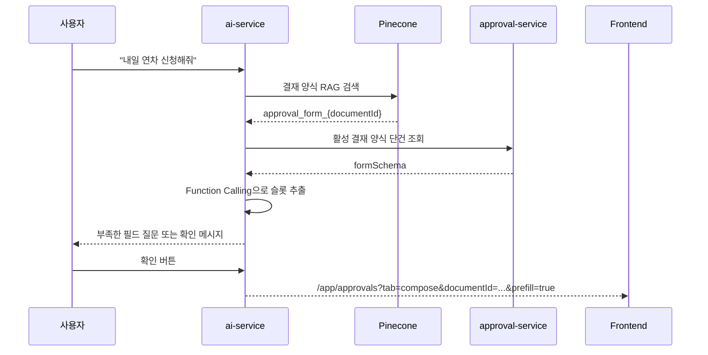

# AI 액션 오케스트레이션

## 개요

`ai-service`는 단순 질의응답 RAG뿐 아니라 사용자의 대화에서 업무 수행에 필요한 값을 추출해 화면 이동 또는 API 실행까지 연결합니다.  
현재 구현된 액션은 결재 양식 작성 prefill과 캘린더 일정 등록입니다.

## 액션 라우터

| Router | API | 결과 |
|--------|-----|------|
| 결재 액션 | `POST /ai/action` | 결재 양식 매칭, 필수 필드 수집, 작성 화면 prefill |
| 캘린더 액션 | `POST /ai/calendar-action` | 일정 정보 수집, 개인 일정 생성 |

두 API 모두 Gateway가 전달한 `X-User-CompanyId`, `X-User-UUID`, `X-User-MemberPositionId`, `Authorization` 헤더를 사용합니다.

## 결재 양식 작성 흐름

## 결재 액션 핵심 설계

| 단계 | 구현 포인트 |
|------|-------------|
| 양식 매칭 | Pinecone에서 `category=결재`로 검색하고 `approval_form_{documentId}` 파일명에서 양식 ID 추출 |
| 최신 양식 조회 | `approval-service` 내부 API로 formSchema 재조회 |
| Tool 생성 | formSchema fields를 OpenAI Function Calling JSON Schema로 변환 |
| 조건부 필드 | `visibleWhen` 조건을 고려해 필수 입력 여부 판단 |
| 값 추출 | 명시된 값만 추출하고 날짜는 현재 날짜 기준으로 변환 |
| 세션 검증 | session owner와 현재 사용자 ID가 다르면 접근 차단 |
| 최종 처리 | 결재 자체를 AI가 제출하지 않고 작성 화면으로 이동시켜 결재선, 참조자, 첨부파일은 사용자가 확인 |

## 캘린더 일정 등록 흐름

캘린더 액션은 고정 Function Calling tool로 `title`, `description`, `startAt`, `endAt`을 추출합니다.  
필수값이 모두 채워지면 사용자 확인 후 `member-service`의 개인 일정 생성 API를 호출하고 `/app/calendar`로 이동할 수 있는 응답을 반환합니다.

| 규칙 | 내용 |
|------|------|
| 날짜 해석 | 오늘/내일/모레는 현재 날짜 기준으로 변환 |
| 시간 누락 | 시간이 명시되지 않으면 startAt/endAt을 임의 생성하지 않음 |
| 종료 시각 | 시작 시각만 있으면 1시간 일정으로 보정 가능 |
| 슬롯 보존 | 이전 대화에서 채운 값은 명시적 변경 없이는 덮어쓰지 않음 |
| 취소 | “취소”, “그만”, “다른 질문” 등의 입력으로 세션 종료 |

## 안전장치

- AI가 결재를 직접 상신하지 않고 prefill까지만 수행합니다.
- 결재선, 참조자, 첨부파일은 프론트 작성 화면에서 사용자가 최종 확인합니다.
- 세션 상태에는 회사 ID, 사용자 ID, 멤버 포지션 ID를 저장해 대화 중 사용자 혼선을 막습니다.
- 선택 필드는 formSchema의 enum/options를 사용해 허용된 값만 추출하도록 유도합니다.
