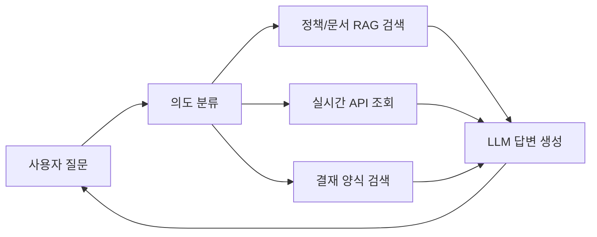
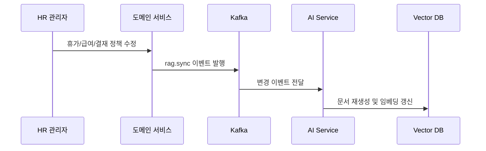

# AI 챗봇 및 RAG 아키텍처

## 목적

WORKFORCE의 AI 챗봇은 신입사원과 일반 사용자가 담당자에게 묻지 않아도 인사 시스템을 사용할 수 있도록 돕는 온보딩 인터페이스입니다.  
핵심은 일반적인 FAQ 챗봇이 아니라, **회사별 정책과 실시간 HR 데이터를 함께 조회하는 맞춤형 AI**입니다.

## 핵심 흐름

## FastAPI 라우터 구성

`ai-service`는 Gateway의 `/ai/**` 라우팅 뒤에서 다음 기능을 제공합니다.

| Router | 주요 경로 | 역할 |
|--------|-----------|------|
| RAG | `/ai/rag/search` | 질문, 회사 ID, 대화 이력을 받아 RAG context와 출처 반환 |
| Document | `/ai/documents/upload`, `/ai/documents`, `/ai/documents/{id}` | HR 업로드 문서 저장, 목록, 삭제 |
| Platform | `/ai/admin/platform/documents`, `/ai/admin/platform/documents/reseed` | 플랫폼 공통 가이드 문서 조회와 재시드 |
| Sync | Kafka background consumer | 정책/양식 변경 이벤트를 받아 `db_sync` 문서 재생성 |
| Action | `/ai/action` | 결재 양식 자동 작성 prefill |
| Calendar Action | `/ai/calendar-action` | 개인 캘린더 일정 생성 |
| Transcribe | `/ai/transcribe`, `/ai/transcribe/summary` | 음성 STT와 회의록 요약 |

## 3-Layer RAG 구조

| Layer | 데이터 | 목적 |
|-------|--------|------|
| Layer 1 Platform | 공통 시스템 사용법, 메뉴 가이드 | 모든 회사가 공유하는 기본 사용 안내 |
| Layer 2 DB Sync | 휴가, 급여, 근태, 결재 정책 | 회사 설정 변경 시 자동 동기화되는 정책 데이터 |
| Layer 3 HR Uploaded | HR 담당자가 업로드한 내부 규정/가이드 | 회사별 별도 문서 기반 답변 |

## 플랫폼 공통 가이드 자동 시드

서버 시작 시 `app/platform/seed_data`의 가이드 문서를 DB와 Pinecone에 자동 동기화합니다.

| 처리 | 설명 |
|------|------|
| 신규 파일 | `platform` layer 문서로 삽입 후 임베딩 |
| 변경 파일 | 기존 Pinecone vector 삭제 후 재삽입 |
| 삭제 파일 | DB `del_yn` 처리와 vector 삭제 |
| 수동 재동기화 | `/ai/admin/platform/documents/reseed` |

현재 플랫폼 seed에는 결재 작성/대기함/내 문서, 근태, 스케줄, 평가, 목표, 휴가 신청, 면담, 내 정보, 비밀번호 변경, 급여 조회 등 사용자 온보딩 가이드가 포함됩니다.

## 회사별 데이터 격리

- 회사 ID를 기준으로 벡터 저장소 namespace 또는 metadata filter를 적용합니다.
- 회사 A의 휴가 정책이 회사 B의 챗봇 답변에 섞이지 않도록 검색 범위를 제한합니다.
- 시스템 공통 가이드는 공유하되, 정책성 답변은 회사별 데이터를 우선합니다.

## 의도 분류

질문은 다음 카테고리 중 하나로 분류합니다.

| 카테고리 | 예시 질문 | 처리 방식 |
|----------|-----------|-----------|
| 정책 | "우리 회사 연차 기준이 뭐야?" | RAG 검색 |
| 근태 | "이번 달 내 근태 현황 보여줘" | 실시간 API 조회 |
| 급여 | "이번 달 명세서 확인하고 싶어" | 실시간 API 조회 |
| 결재 | "휴가 신청서 어디서 작성해?" | 결재 양식 검색 |
| 목표/평가 | "내 평가 시즌 언제까지야?" | API 조회 또는 정책 검색 |
| ESG | "ESG 포인트는 어떻게 적립돼?" | 정책/기능 가이드 검색 |
| 캘린더 | "내 휴가 일정 보여줘" | API 조회 |
| 사용법 | "연차 신청 메뉴 어디야?" | 플랫폼 가이드 검색 |

## 정책 자동 동기화

정책이 변경되면 각 도메인 서비스가 Kafka 이벤트를 발행하고, AI 서비스가 이를 받아 벡터 DB를 갱신합니다.

## 동기화 대상

AI 서비스의 Kafka consumer는 `ai-service-rag-sync` group으로 다음 topic을 구독합니다.

| Topic | 동기화 문서 |
|-------|-------------|
| `rag.sync.leave` | 휴가 유형, 연차 정책, 이월/수당 정책 |
| `rag.sync.attendance` | 근무 스케줄, 연장근로 정책, 공휴일 |
| `rag.sync.salary` | 지급/공제 항목, 급여 정책, 호봉표 |
| `rag.sync.approval` | 활성 결재 양식, 입력 항목, 캘린더 연동 정보 |

동기화된 문서는 `db_sync` layer에 저장되며, 동일한 회사의 기존 자동 생성 문서를 삭제한 뒤 최신 내용으로 재생성합니다.

## 검색 정확도 보정

- 질문에서 카테고리를 감지한 뒤 우선 해당 카테고리로 검색합니다.
- 매칭이 없으면 플랫폼 가이드까지 포함한 전체 검색으로 fallback합니다.
- 같은 category/subcategory가 여러 layer에서 발견되면 `db_sync > hr_uploaded > platform` 우선순위를 적용합니다.
- 답변 context 앞에는 현재 날짜 정보를 붙여 “오늘”, “내일”, “이번 달” 같은 표현을 안정적으로 해석하도록 합니다.

## 기술 구성

- FastAPI: AI API 서버
- OpenAI: 임베딩 및 답변 생성
- Pinecone: 벡터 저장소
- n8n: 의도 분류, 분기, 검색, LLM 호출 워크플로우 오케스트레이션
- redis stack: 의미 기반 캐시
- Kafka: 정책 변경 이벤트 동기화
- SQLAlchemy: HR 문서 메타데이터 관리
- PyPDF, python-docx: 업로드 문서 텍스트 추출
