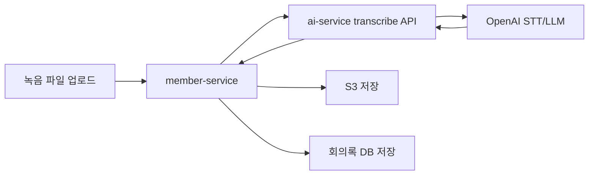

# AI 회의록과 음성 처리

## 개요

AI 회의록은 `member-service`에서 파일과 회의록 메타데이터를 관리하고, 실제 음성 인식과 요약은 `ai-service`의 FastAPI API로 위임합니다.

## 처리 흐름

## member-service 역할

- 업로드 요청 수신
- 사용자/회사 헤더 기반 권한 및 소유자 확인
- ai-service Feign multipart 호출
- 변환 결과 저장
- S3 파일 저장 및 조회/수정/삭제 API 제공

## ai-service 역할

- 오디오 파일 유효성 검증
- OpenAI 기반 STT 처리
- 회의 내용 요약/구조화
- 오류를 FastAPI `HTTPException`으로 반환

## 엔드포인트와 검증

| API | 역할 |
|-----|------|
| `POST /ai/transcribe` | 오디오 파일을 Whisper STT로 변환한 뒤 GPT로 회의록 요약 |
| `POST /ai/transcribe/summary` | 이미 가진 transcript 텍스트만 회의록 형태로 정리 |

오디오 업로드는 `webm`, `ogg`, `mp3`, `m4a`, `mp4`, `wav`, `mpga`, `mpeg` 확장자를 허용하고, Whisper API 한도에 맞춰 25MB 이하 파일만 처리합니다.

## 회의록 출력 구조

요약 프롬프트는 다음 섹션을 고정 형식으로 생성합니다.

| 섹션 | 내용 |
|------|------|
| 회의 요약 | 회의 목적 한 문장 요약 |
| 주요 결정사항 | 합의/결정된 항목 |
| 액션 아이템 | 담당자, 할 일, 기한 |
| 주요 논의 내용 | 결정 배경과 논의 요약 |
