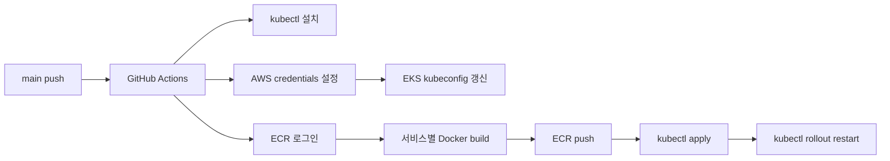

# CI/CD와 컨테이너 배포

## 개요

`be-devops` 저장소의 `.github/workflows/deploy.yml`은 `main` 브랜치 push 시 백엔드 서비스를 빌드하고 ECR에 이미지를 올린 뒤 EKS에 반영합니다.

## 배포 파이프라인

## 빌드/배포 대상

| 서비스 | Dockerfile | ECR Repository | Deployment |
|--------|------------|----------------|------------|
| gateway | `gateway/Dockerfile` | `4team/gateway` | `gateway-depl` |
| member-service | `member-service/Dockerfile` | `4team/member` | `member-depl` |
| salary-service | `salary-service/Dockerfile` | `4team/salary` | `salary-depl` |
| approval-service | `approval-service/Dockerfile` | `4team/approval` | `approval-depl` |
| goal-service | `goal-service/Dockerfile` | `4team/goal` | `goal-depl` |
| search-service | `search-service/Dockerfile` | `4team/search` | `search-depl` |
| ai-service | `ai-service/Dockerfile` | `4team/ai` | `ai-depl` |

## Spring 서비스 이미지 전략

Spring 서비스 Dockerfile은 공통적으로 멀티스테이지 빌드를 사용합니다.

| 단계 | 내용 |
|------|------|
| Build stage | `eclipse-temurin:17-jdk`, Gradle wrapper, `common` 모듈과 서비스 모듈 복사 |
| 인증 | `GPR_USER`, `GPR_TOKEN` build arg로 GitHub Packages 인증용 `gradle.properties` 생성 |
| Artifact | `:service:bootJar` 실행 |
| Runtime stage | 빌드된 jar만 복사 후 `spring.profiles.active=prod`로 실행 |

이 방식은 서비스별 jar 생성에 필요한 소스만 이미지 빌드 컨텍스트에 포함하고, 런타임 이미지는 jar 실행 중심으로 단순화합니다.

## AI 서비스 이미지 전략

AI 서비스는 `python:3.11-slim` 기반입니다.

| 항목 | 내용 |
|------|------|
| 런타임 | Python 3.11, FastAPI, Uvicorn |
| 시스템 패키지 | `gcc`, `g++`, `libffi-dev` |
| 의존성 | `requirements.txt` 선설치로 Docker layer cache 활용 |
| 실행 | `uvicorn app.main:app --host 0.0.0.0 --port 8090` |

## Kubernetes 반영 방식

각 서비스는 이미지 push 후 다음 순서로 반영됩니다.

1. `kubectl apply -f <service>/k8s/depl_svc.yml`
2. `kubectl rollout restart deployment <deployment-name> -n 4team`

이미지 태그가 `latest`로 고정되어 있기 때문에 `rollout restart`로 기존 Deployment가 새 이미지를 다시 pull하도록 유도합니다.

## GitHub Actions Secret

| Secret | 용도 |
|--------|------|
| `AWS_KEY` | AWS 인증 |
| `AWS_SECRET` | AWS 인증 |
| `GPR_USER` | GitHub Packages 접근 |
| `GPR_TOKEN` | GitHub Packages 접근 |

애플리케이션 런타임 Secret은 GitHub Actions가 아니라 Kubernetes `workforce-secrets`로 주입합니다.
