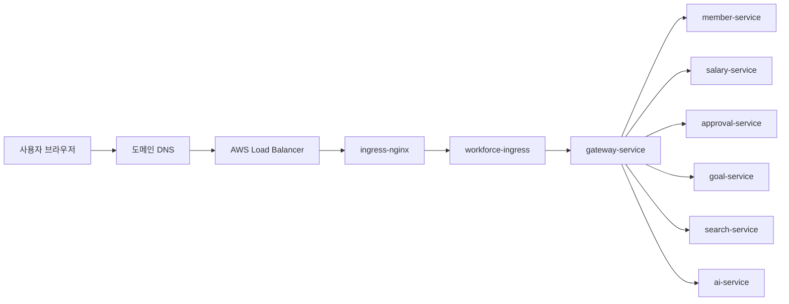

# Kubernetes와 AWS 운영 인프라

## 개요

운영 배포 기준 인프라는 `be-devops` 저장소의 Kubernetes 매니페스트와 GitHub Actions workflow를 기준으로 구성되어 있습니다.  
Spring 서비스는 운영 환경에서 Eureka를 사용하지 않고 Kubernetes Service DNS로 직접 통신하며, 외부 트래픽은 Ingress를 통해 Gateway로 진입합니다.

## 클라우드 구성

| 영역 | 구성 |
|------|------|
| Container Orchestration | AWS EKS |
| Image Registry | AWS ECR |
| Database | Amazon RDS for MariaDB |
| File Storage | Amazon S3 |
| Frontend Hosting | S3 + CloudFront |
| Backend Entry | ingress-nginx -> `gateway-service` |
| TLS | cert-manager + Let's Encrypt |
| Namespace | `4team` |
| Region | `ap-northeast-2` |

## Kubernetes 배포 대상

운영 배포 대상은 Gateway와 6개 애플리케이션 서비스입니다.

| Deployment | Service | Port | 역할 |
|------------|---------|------|------|
| `gateway-depl` | `gateway-service` | 80 -> 8080 | 외부 API 진입점, JWT 검증, 라우팅 |
| `member-depl` | `member-service` | 8080 | 회원, 회사, 조직, 권한, ESG, 알림, 채팅 |
| `salary-depl` | `salary-service` | 8080 | 근태, 휴가, 급여, 배치 |
| `approval-depl` | `approval-service` | 8080 | 전자결재, 계약 |
| `goal-depl` | `goal-service` | 8080 | 목표, 평가, 면담 |
| `search-depl` | `search-service` | 8080 | Elasticsearch 기반 통합 검색 |
| `ai-depl` | `ai-service` | 8090 | FastAPI 기반 AI/RAG |

`eureka` 모듈은 로컬 개발 환경의 서비스 디스커버리에 사용되고, 운영 Kubernetes 환경에서는 비활성화됩니다.

## 외부 진입 흐름

## Ingress와 TLS

- `server.workforcehr.shop`은 Gateway로 라우팅합니다.
- `n8n.workforcehr.shop`은 n8n 서비스로 라우팅합니다.
- TLS 인증서는 `cert-manager`의 `ClusterIssuer`와 `Certificate` 리소스로 발급/갱신합니다.
- 인증서 Secret 이름은 `server-workforcehr-shop-tls`입니다.

## 운영 환경 통신 방식

운영 프로파일의 Gateway route는 `lb://`가 아니라 Kubernetes Service DNS를 사용합니다.

| 호출 대상 | 운영 URI |
|-----------|----------|
| member | `http://member-service:8080` |
| salary | `http://salary-service:8080` |
| approval | `http://approval-service:8080` |
| goal | `http://goal-service:8080` |
| search | `http://search-service:8080` |
| ai | `http://ai-service:8090` |

이 구조는 Pod IP가 바뀌어도 Service가 안정적인 내부 DNS와 로드밸런싱을 제공하도록 하기 위한 선택입니다.
