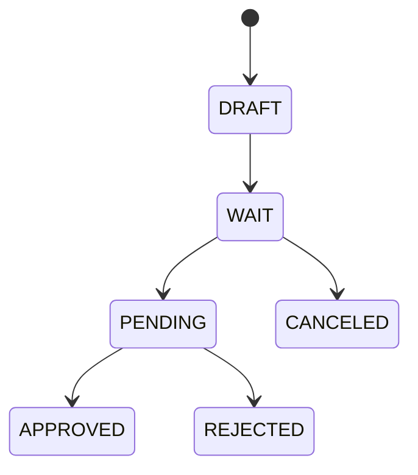

# 전자결재와 전자계약

## 개요

`approval-service`는 전자결재, 동적 결재 양식, 공문, 전자계약을 담당합니다. 결재 승인 이후에는 Kafka 이벤트를 발행해 근태, 캘린더, 인사 발령 등 후속 처리를 연결합니다.

## API 표면

| 영역 | 주요 API | 역할 |
|------|----------|------|
| 결재 양식 | `/approval/documents` | 양식 생성/수정/조회/활성화/비활성화, 기본 양식 초기화 |
| 결재 요청 | `/approval/requests` | 상신, 상세 조회, 내 기안, 임시저장 수정, 취소, 부서 문서함, 공문 발송, PDF |
| 결재 처리 | `/approval/approvals` | 대기함, 처리함, 예정함, 승인, 반려 |
| 참조/공람 | `/approval/viewers` | 참조함, 공람함, 읽음 처리 |
| 부재 위임 | `/approval/absence-proxy` | 위임 등록, 내 위임, 나에게 위임된 목록, 위임 해제 |
| 결재선 정책 | `/approval/policyLines` | 양식별 결재선 정책 저장/조회/삭제, 후보 결재자 조회 |
| 첨부파일 | `/approval/attachments` | 결재 첨부 업로드/조회/삭제 |
| 전자계약 | `/contract/templates`, `/contract/contracts` | 계약 템플릿, 개별/일괄 발송, 서명, 거절, 회수, 재발송, 이력, 리마인드, PDF |

## 전자결재 핵심 모델

| 모델 | 설명 |
|------|------|
| ApprovalDocument | 회사별 결재 양식, JSON formSchema |
| ApprovalRequest | 결재 요청 본문과 상태 |
| Approval | 단계별 결재자, 대리결재 여부, 서명 이미지, 처리 상태 |
| ApprovalViewer | 참조/공람 대상과 읽음 상태 |
| AbsenceProxy | 부재 기간 동안 결재권 위임 |
| ApprovalPolicyLine | 양식별 결재선 정책과 후보 결재자 |
| OfficialRecipient | 공문 수신 조직 |
| Attachment | 결재 요청 첨부파일 |

## 상태 흐름

## 동적 양식

결재 양식은 JSON formSchema로 저장합니다. 휴가, 근태 정정, 외근, 출장, 인사 발령, 계약 등 요청 유형에 따라 필요한 필드를 회사가 직접 구성할 수 있습니다.

## 기본 결재 양식 시드

회사 생성 시 내부 API로 기본 결재 양식을 자동 생성할 수 있습니다.

| 유형 | 기본 양식 |
|------|-----------|
| 휴가 | 휴가신청서, 휴직 신청서 |
| 근태 | 연장근무신청, 근태정정신청, 조퇴계, 출퇴근시간 변경 신청서 |
| 인사/급여 | 사직서, 수당 변경 신청, 인사발령품의서 |
| 출장 | 국내출장신청, 해외출장신청 |
| 일반/공문 | 업무기안, 업무보고서, 공문 |

양식 생성/수정/활성화/비활성화 시 `rag.sync.approval` 이벤트를 발행해 AI 챗봇의 결재 양식 검색 문서를 갱신합니다.

## 후속 처리 이벤트

| 결재 유형 | 후속 처리 |
|-----------|-----------|
| 휴가신청서 | 연차 잔고 차감, 근태 반영 |
| 연장근무신청 | 초과근무 승인 반영 |
| 근태정정신청 | 일별 출퇴근 시각 재계산 |
| 조퇴계 | 조퇴 처리와 정규 근무 보정 |
| 출퇴근시간 변경 신청서 | 시차출퇴근 스케줄 선택 반영 |
| 휴직 신청서 | 휴직 상태 반영 |
| 국내/해외 출장신청 | 출장 기간, 출장비 합계 반영 |
| 수당 변경 신청 | 급여 수당 변경 승인 |
| 사직서 | 구성원 퇴직 상태 및 퇴직금 정산 연결 |
| 인사발령품의서 | 조직/직급/직책 변경 및 이력 생성 |

## 공문과 부서 문서함

- 부서 문서함은 본인 부서와 하위 조직의 결재 요청을 모아 조회합니다.
- 공문은 승인된 문서를 수신 조직에 발송하고, 수신 부서는 공문 수신함에서 조회합니다.
- `OfficialRecipient`를 통해 공문 수신 대상을 분리해 일반 결재함과 공문 문서함을 함께 지원합니다.

## 부재 위임과 결재함

부재 위임은 지정 기간 동안 다른 구성원이 대신 결재할 수 있게 하는 기능입니다.

| 기능 | 설명 |
|------|------|
| 내 위임 목록 | 내가 등록한 현재/미래 위임 조회 |
| 위임받은 목록 | 나에게 위임된 결재 권한 조회 |
| 대기함 | 내가 직접 결재할 문서와 위임받은 문서를 함께 조회 |
| 비활성화 | 위임 기간 중 취소 가능 |

## 검색 인덱스 연동

결재 문서 저장/삭제는 검색 outbox를 통해 Kafka 이벤트로 발행되고, `search-service`가 Elasticsearch 결재 인덱스를 갱신합니다.  
이 방식은 결재 트랜잭션과 검색 색인을 분리해 검색 장애가 결재 저장 흐름을 막지 않도록 하기 위한 구조입니다.

## 전자계약

- 계약 템플릿을 등록하고 대상자에게 개별 또는 일괄 발송합니다.
- 기본 템플릿으로 근로계약서, 연봉계약서, 비밀유지서약서, 개인정보 수집·이용 동의서를 제공합니다.
- member-service와 salary-service를 호출해 이름, 사번, 부서, 직책, 급여 같은 계약서 필드를 자동 채웁니다.
- 법인인감과 직원 서명 이미지를 반영합니다.
- 직원은 본인 계약만 상세 조회, 서명, 거절, 이력 조회할 수 있습니다.
- 인사팀은 계약 회수, 개별/일괄 재발송, 미서명자 리마인드, PDF 다운로드를 수행할 수 있습니다.
- 서명 완료 시 `ContractSignedEvent`를 발행해 급여/인사 후속 처리와 연결할 수 있습니다.

## 계약 재발송 이력

계약이 거절되거나 회수되면 기존 계약을 수정하지 않고 새 revision을 생성합니다.

| 항목 | 설명 |
|------|------|
| `previousContractId` | 이전 계약과 새 계약을 연결 |
| `revision` | 재발송 차수 |
| 재발송 제한 | 최대 5회 |
| 이력 조회 | 최신 계약에서 이전 계약을 따라가며 revision 순으로 정렬 |
