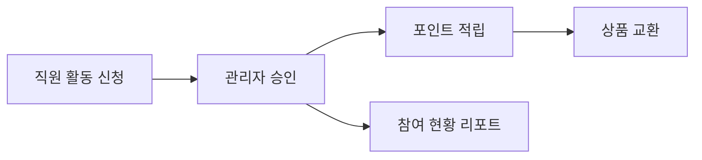

# ESG 활동 관리

## 목적

WORKFORCE는 ESG를 단순 부가 메뉴가 아니라 조직 참여를 HR 데이터와 연결하는 기능으로 설계했습니다.  
직원 참여, 승인, 포인트, 캠페인, 교환 내역을 한 흐름에서 관리해 기업의 ESG 활동 증적과 참여 지표를 남길 수 있습니다.

## 주요 기능

| 기능 | 설명 |
|------|------|
| ESG 활동 신청 | 직원이 환경, 사회, 거버넌스 활동을 신청 |
| 관리자 승인 | HR 또는 관리자 권한으로 활동 승인/반려 |
| 포인트 적립 | 승인된 활동 기준으로 ESG 포인트 지급 |
| 캠페인 운영 | 회사 단위 ESG 캠페인 등록, 기간 설정, 참여 관리 |
| 포인트 교환 | 적립 포인트로 사내 상품 교환 |
| 참여 현황 분석 | 부서, 직급, 직원별 참여 현황 조회 |

## 데이터 흐름

## HRMS 안에서 ESG를 다루는 이유

- ESG 참여는 직원, 부서, 직급 등 HR 데이터와 자연스럽게 연결됩니다.
- 별도 시스템 없이 활동 증적과 참여율을 관리할 수 있습니다.
- 향후 Vision AI 기반 활동 인증, 데이터 분류, 보고서 자동화로 확장할 수 있습니다.
