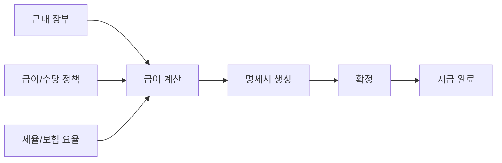

# 급여·상여·퇴직금 도메인

## 개요

`salary-service`의 `salary` 패키지는 급여 정책, 급여 명세서, 수당, 세금/4대보험, 상여, 퇴직금, 연차수당을 담당합니다. 근태 장부와 구성원 정보를 조합해 정산 데이터를 생성합니다.

## 급여 정책

| 영역 | 설명 |
|------|------|
| 급여 지급 기준 | 정산일, 지급월, 말일 보정, 연봉제/호봉제 |
| 지급/공제 항목 | 회사별 급여 항목 템플릿 |
| 수당 | 직원별 수당 부여, 차등 금액, 종료 처리 |
| 세금/4대보험 | 국민연금, 건강보험, 장기요양, 고용보험, 소득세, 지방소득세 |
| 호봉표 | 호봉제 정책과 금액 테이블 |

## 급여 명세서 흐름

## 상여

- 정기상여, 성과급, 명절상여를 정책으로 관리합니다.
- 평가 결과를 성과급 대상/비율 산정에 연결할 수 있습니다.
- 상여 발행 전 preview로 대상과 금액을 검토합니다.

## 퇴직금

- 법정 퇴직금, DB, DC 유형을 정책으로 관리합니다.
- 퇴직 시뮬레이션과 실제 정산을 분리합니다.
- 평균임금, 통상임금, 미사용 연차수당, 퇴직소득세를 고려합니다.

## PDF/엑셀

- 급여명세서 PDF 생성에 OpenPDF 계열 라이브러리를 사용합니다.
- 급여/정산 데이터 export에는 Apache POI를 사용합니다.
