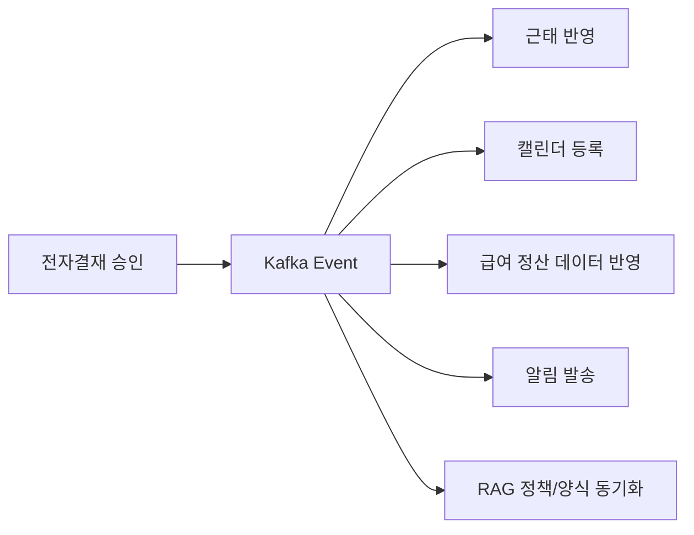
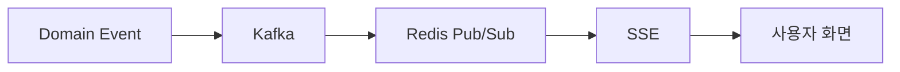

# 이벤트 기반 시스템 연동

## 목적

HR 업무는 하나의 승인으로 끝나지 않습니다. 휴가가 승인되면 연차 잔고, 근태, 캘린더, 알림이 함께 바뀌어야 합니다.  
WORKFORCE는 서비스 간 강한 결합을 줄이기 위해 Kafka 기반 이벤트 흐름으로 후속 처리를 분리했습니다.

## 주요 이벤트 흐름

## 적용 사례

| 이벤트 | 발행 서비스 | 구독/처리 |
|--------|-------------|-----------|
| 휴가 결재 승인 | approval-service | salary-service 근태/연차 반영, member-service 캘린더 등록 |
| 급여 명세서 발행 | salary-service | member-service 알림 발송 |
| 정책 변경 | member/salary/approval-service | ai-service RAG 인덱스 갱신 |
| 결재 양식 변경 | approval-service | ai-service 결재 양식 RAG 문서 갱신 |
| 계약 서명 완료 | approval-service | salary/member 후속 처리와 알림 연동 |
| 평가 결과 발행 | goal-service | salary-service 성과급 prefill 데이터 연결 |

## 알림 파이프라인

- Kafka는 서비스 간 이벤트 전달을 담당합니다.
- Redis Pub/Sub은 다중 서버 인스턴스에서 알림을 브로드캐스트합니다.
- SSE는 클라이언트 화면에 실시간 알림을 푸시합니다.
- 알림 데이터는 DB에도 저장되어 재접속 시 확인할 수 있습니다.

## Outbox 패턴

도메인 트랜잭션과 Kafka 발행 사이의 불일치를 줄이기 위해 Outbox 패턴을 적용할 수 있습니다.

- 비즈니스 데이터와 이벤트 기록을 같은 트랜잭션으로 저장합니다.
- 별도 퍼블리셔가 Outbox 테이블을 읽어 Kafka로 발행합니다.
- Kafka 장애가 발생해도 이벤트 유실 가능성을 줄입니다.
