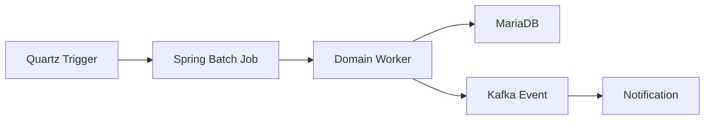

# 업무 자동화와 배치 처리

## 목적

인사 업무는 정기적으로 반복되지만 누락되면 법적·운영 리스크가 커지는 작업이 많습니다.  
WORKFORCE는 Quartz와 Spring Batch를 이용해 연차, 근태, 급여, 상여, 퇴직금 업무를 자동화합니다.

## 자동화 대상

| 업무 | 자동화 내용 |
|------|-------------|
| 연차 부여 | 입사일 기준 또는 회계연도 기준 자동 부여 |
| 연차 사용 촉진 | 근로기준법 제61조 기준 1차/2차 알림 대상자 자동 필터링 |
| 일일 근태 마감 | 출퇴근, 휴가, 외근, 이상 근태를 집계 |
| 월 근태 마감 | 월별 근태 장부 생성 |
| 급여 명세서 | 근태, 수당, 공제, 세금 반영 후 명세서 생성 |
| 정기상여 | 회사 정책에 맞춰 회차별 상여 발행 |
| 퇴직금 정산 | 퇴직 신청 승인 후 예상/확정 퇴직금 산정 |

## 처리 흐름

## 연차 촉진 자동 필터링

연차 촉진은 수동으로 대상자를 추려야 하는 대표적인 반복 업무입니다.

| 단계 | 필터 조건 |
|------|-----------|
| 1차 촉진 | 잔여 연차가 있는 직원 |
| 2차 촉진 | 잔여 연차가 있고 1차 촉진에 회신하지 않은 직원 |

자동 필터링 후 대상자에게 알림을 발송해 담당자의 반복 확인 업무를 줄입니다.

## 법령/정책 검증

- 주 52시간 초과 여부
- 일일/월간 연장근로 한도
- 잔여 연차 부족 여부
- 급여 항목별 지급/공제 정책
- 퇴직금 산정 기준
