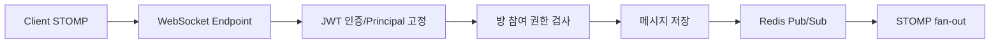

# 실시간 채팅과 파일 처리

## 개요

사내 메신저는 `member-service`의 `memberchat` 패키지에서 WebSocket/STOMP 기반으로 구현되어 있습니다. 일반 알림은 SSE를 사용하지만, 채팅은 양방향 실시간성이 필요하므로 STOMP WebSocket을 별도 채널로 분리했습니다.

## 핵심 구성

| 구성 | 역할 |
|------|------|
| `StompChatConfig` | WebSocket endpoint와 broker prefix 설정 |
| `ChatStompHandler` | CONNECT 프레임의 JWT 검증 |
| `ChatChannelInterceptor` | SUBSCRIBE/SEND destination 권한 검사 |
| `ChatStompController` | 메시지 송신, 타이핑 이벤트 |
| `RedisChatSubscriberConfig` | Redis Pub/Sub 메시지를 로컬 STOMP 구독자에게 fan-out |
| `ChatAuthPolicy` | 방 참여자/권한 검증 |
| `ChatFileController` | 첨부 파일 업로드, presigned URL, 다운로드 프록시 |

## 흐름

## 파일 처리

- 채팅 첨부는 S3에 저장합니다.
- 업로드 후 메시지와 파일 메타데이터를 연결합니다.
- 브라우저에서 Authorization 헤더 없이 이미지를 로드해야 하는 경우 다운로드 프록시 또는 presigned URL을 사용합니다.
