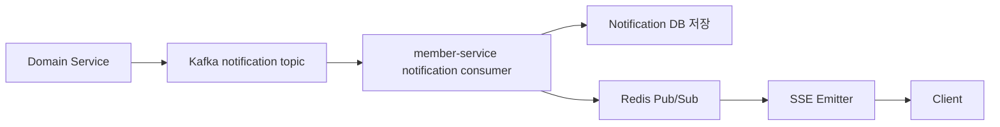

# 알림·SSE·Redis Pub/Sub

## 개요

알림은 여러 도메인에서 발생하지만 최종 저장과 전달은 `member-service`가 담당합니다. 도메인 서비스는 공통 `NotificationMessage` 이벤트를 발행하고, Kafka와 Redis Pub/Sub을 거쳐 사용자 화면에 SSE로 전달합니다.

## 흐름

## 사용 기술

| 기술 | 역할 |
|------|------|
| Spring ApplicationEvent | 도메인 내부에서 알림 이벤트 발행 |
| Kafka | 서비스 간 알림 메시지 전달 |
| Redis Pub/Sub | 여러 서버 인스턴스에 알림 브로드캐스트 |
| SSE | 서버에서 클라이언트로 실시간 단방향 푸시 |
| DB | 오프라인/재접속 사용자를 위한 알림 영속화 |

## 알림 타입

`NotificationType`은 급여, 연차, 결재, 평가, ESG 등 도메인별 알림 타입을 공통 enum으로 관리합니다. 새 알림을 추가할 때 타입을 공통으로 맞추면 프론트와 백엔드의 분기 기준이 통일됩니다.

## SSE를 선택한 이유

- 알림은 서버에서 클라이언트로 보내는 단방향 이벤트가 중심입니다.
- WebSocket보다 구현이 단순하고 HTTP 기반으로 동작합니다.
- 채팅처럼 양방향 실시간성이 강한 기능은 별도 STOMP WebSocket으로 분리했습니다.
