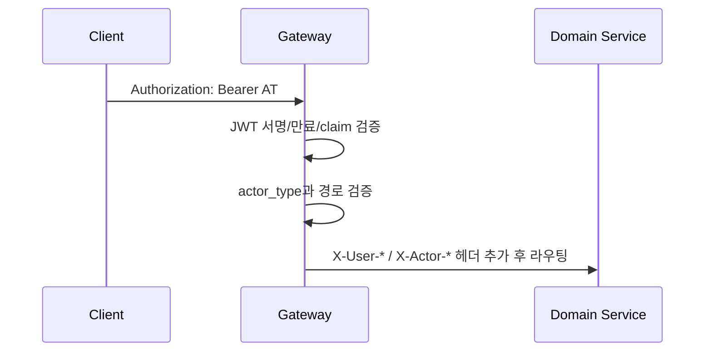

# 인증·인가·멀티테넌시

## 개요

WORKFORCE의 인증 흐름은 `member-service`에서 토큰을 발급하고, `gateway`가 모든 요청의 JWT를 검증한 뒤 내부 서비스에 사용자 컨텍스트를 헤더로 전파하는 구조입니다.

## 로그인과 토큰 발급

| 단계 | 처리 |
|------|------|
| 로그인 | `member-service`가 이메일/비밀번호를 검증하고 실패 횟수를 관리 |
| Access Token | JWT로 발급되며 사용자 ID, 회사 ID, 직위 ID, 관리자 여부, actor type 등을 claim에 포함 |
| Refresh Token | Redis에 저장하고 쿠키로 내려 재발급에 사용 |
| AT 재발급 | `/member/generate-at`에서 RT 검증 후 새 AT 발급 |
| 비밀번호 변경 | 최초 로그인/강제 변경 시 비밀번호 변경 후 RT를 삭제해 세션을 정리 |

## Gateway 인증 필터

`JwtAuthFilter`는 Spring Cloud Gateway의 `GlobalFilter`입니다.

## 내부 서비스로 전달되는 헤더

| 헤더 | 용도 |
|------|------|
| `X-Actor-Type` | `MEMBER` 또는 `OPERATOR` 구분 |
| `X-User-UUID` | 멤버 ID |
| `X-User-MemberPositionId` | 현재 직위 ID, 권한 캐시 키로 사용 |
| `X-User-CompanyId` | 회사 단위 데이터 격리 기준 |
| `X-User-Name` | 사용자 이름 |
| `X-User-IsSystemAdmin` | 시스템 관리자 여부 |
| `X-Operator-Email` | SaaS 운영자 이메일 |
| `X-Operator-Name` | SaaS 운영자 이름 |

## 멀티테넌시

- 대부분의 업무 데이터는 `companyId` 기준으로 조회/수정 범위를 제한합니다.
- 도메인 서비스는 Gateway가 주입한 `X-User-CompanyId`를 신뢰 기준으로 사용합니다.
- SaaS 운영자 경로(`/saas/**`)와 일반 앱 경로(`/app/**`에서 호출되는 API)는 actor type으로 분리합니다.

## 공개 경로와 내부 경로

Gateway는 로그인, 회사 온보딩, 비밀번호 재설정, STOMP 연결, 일부 내부 조회 API를 허용 경로로 둡니다.  
다만 내부 조회 API는 외부 노출을 최소화해야 하며, 운영 환경에서는 네트워크 정책과 Gateway 라우팅 정책으로 보완합니다.
