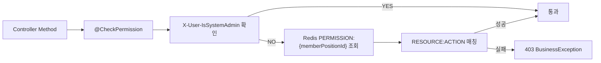

# 권한 모델과 역할 설계

## 개요

WORKFORCE는 회사별로 역할을 만들고, 역할에 여러 권한을 연결하는 구조를 사용합니다. API 단계에서는 Gateway가 전달한 사용자 헤더와 Redis 권한 캐시를 조합해 접근을 제어합니다.

## 권한 표현

권한은 리소스와 액션을 중심으로 표현합니다.

| 요소 | 예시 |
|------|------|
| Resource | MEMBER, APPROVAL, EVALUATION, CALENDAR, SALARY |
| Action | READ, CREATE, UPDATE, DELETE |
| Scope | SELF, TEAM, DEPARTMENT, COMPANY |

공통 AOP는 `RESOURCE:ACTION` prefix를 기준으로 검사하고, 팀/부서/회사 범위 검증은 각 서비스의 비즈니스 로직에서 추가 확인합니다.

## `@CheckPermission` AOP

## 권한 캐시

- 로그인 또는 권한 변경 시 멤버 직위 기준 권한 문자열을 Redis에 저장합니다.
- 역할/권한이 변경되면 관련 직위의 권한 캐시를 삭제해 다음 로그인 또는 조회 시 갱신되도록 합니다.
- 권한 캐시가 없으면 “다시 로그인” 계열 오류를 내려 stale 권한 사용을 방지합니다.

## 회사별 역할

- 회사 생성 시 기본 역할을 시드합니다.
- 관리자는 회사 내부 정책에 맞게 커스텀 역할을 만들 수 있습니다.
- 역할은 사용자 한 명이 아니라 `MemberPosition`에 연결되어 조직/직책 변경과 함께 관리됩니다.
