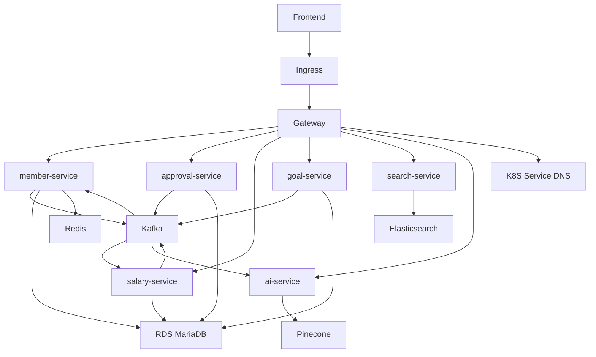

# 시스템 아키텍처

## 서비스 구성

WORKFORCE는 MSA 기반으로 도메인별 서비스를 분리했습니다.

| 서비스 | 역할 |
|--------|------|
| gateway | 인증, 라우팅, 공통 필터 |
| eureka | 로컬 개발 환경의 서비스 디스커버리 |
| common | 공통 응답, 예외, 이벤트, 인프라 설정 |
| member-service | 회원, 회사, 조직, 권한, 캘린더, 채팅, 알림 |
| approval-service | 전자결재, 동적 양식, 계약 |
| salary-service | 근태, 휴가, 급여, 상여, 퇴직금 |
| goal-service | 목표, 평가, 피드백, 보정 |
| search-service | 통합 검색 |
| ai-service | AI 챗봇, RAG, 회의록 요약 |

## 전체 흐름

## 인프라 구성

| 영역 | 기술 |
|------|------|
| API 서버 | Spring Boot, FastAPI |
| Service Discovery | 로컬: Eureka, 운영: Kubernetes Service DNS |
| Gateway | Spring Cloud Gateway |
| DB | Amazon RDS for MariaDB, Redis, Redis Stack, Elasticsearch, Pinecone |
| Event | Kafka KRaft |
| Batch | Quartz, Spring Batch |
| File | AWS S3 |
| Deploy | Docker, GitHub Actions, AWS ECR, AWS EKS, ingress-nginx, cert-manager |
| Availability | HPA, PDB, RollingUpdate, readiness/liveness probe |

## 운영 배포 구조

운영 환경은 `be-devops` 저장소의 Kubernetes 매니페스트를 기준으로 배포됩니다.

| 항목 | 운영 기준 |
|------|-----------|
| Namespace | `4team` |
| Backend ingress | `server.workforcehr.shop` -> `gateway-service` |
| Workflow | GitHub Actions `main` push 기반 빌드/배포 |
| Image registry | AWS ECR `4team/<service>` |
| Runtime config | Kubernetes Secret `workforce-secrets` |
| Health check | Spring `/actuator/health`, FastAPI `/health` |

운영에서는 Eureka를 비활성화하고 Gateway가 `http://member-service:8080` 같은 Kubernetes Service DNS로 라우팅합니다.
